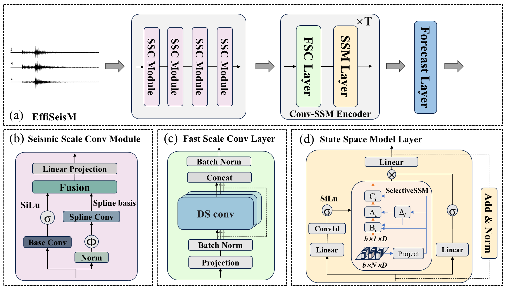

- [EffiSeisM Architecture](#seist-architecture)

- [Usage](#usage)
  - [Training](#training)
  - [Fine-tuning](#fine-tuning)
  - [Testing](#testing)
- [Citation](#citation)
- [Acknowledgement](#acknowledgement)


## EffiSeisM Architecture
<p align="center">
  
</p>


## Usage


- **Model Configuration**<br/>
  The configuration of the loss function and model labels is in `config.py`, and a more detailed explanation is provided in this file.


- **Start training**<br/>
  If you are training with a CPU or a single GPU, please use the following command to start training:
  ```Shell
  python main.py \
    --seed 0 \
    --mode "train_test" \
    --model-name "EffiSeisM_dpk" \
    --log-base "./logs" \
    --device "cuda:0" \
    --data "/root/data/Datasets/Diting50hz" \
    --dataset-name "diting" \
    --data-split true \
    --train-size 0.8 \
    --val-size 0.1 \
    --shuffle true \
    --workers 8 \
    --in-samples 8192 \
    --augmentation true \
    --epochs 200 \
    --patience 30 \
    --batch-size 500
  ```
  
  If you are training with multiple GPUs, please use `torchrun` to start training:
  ```Shell
  torchrun \
    --nnodes 1 \
    --nproc_per_node 2 \
    main.py \
      --seed 0 \
      --mode "train_test" \
      --model-name "EffiSeisM_dpk" \
      --log-base "./logs" \
      --data "/root/data/Datasets/Diting50hz" \
      --dataset-name "diting" \
      --data-split true \
      --train-size 0.8 \
      --val-size 0.1 \
      --shuffle true \
      --workers 8 \
      --in-samples 8192 \
      --augmentation true \
      --epochs 200 \
      --patience 30 \
      --batch-size 500
  ```
  
  There are also many other custom arguments, see `main.py` for more details.

  
### Fine-tuning

The following table provides the pre-trained checkpoints used in the paper:
<table><tbody>

<th valign="bottom">Task</th>
<th valign="bottom">Train set</th>
<th valign="bottom">EffiSeisM</th>


<tr><td align="left">Detection & Phase Picking</td>
<td align="left">DiTing</td>
<td align="center"><a href="https://github.com/xiaoangxixi/EffiSeisM/blob/main/checkpoints/EffiSeisM_dpk_diting.pth?raw=true" download>download</a></td>
</tr>

<tr><td align="left">Detection & Phase Picking</td>
<td align="left">DiTingv2</td>
<td align="center"><a href="https://github.com/xiaoangxixi/EffiSeisM/blob/main/checkpoints/EffiSeisM_dpk_ditingv2.pth?raw=true" download>download</a></td>
</tr>

<tr><td align="left">Magnitude Estimation</td>
<td align="left">DiTing</td>
<td align="center"><a href="https://github.com/xiaoangxixi/EffiSeisM/blob/main/checkpoints/EffiSeisM_emg_diting.pth?raw=true" download>download</a></td>
</tr>


Use the "--checkpoint" argument to pass in the path of the pre-training weights.

### Testing
  If you are testing with a CPU or a single GPU, please use the following command to start testing:

  ```Shell
  python main.py \
    --seed 0 \
    --mode "test" \
    --model-name "seist_m_dpk" \
    --log-base "./logs" \
    --device "cuda:0" \
    --data "/root/data/Datasets/Diting50hz" \
    --dataset-name "diting" \
    --data-split true \
    --train-size 0.8 \
    --val-size 0.1 \
    --workers 8 \
    --in-samples 8192 \
    --batch-size 500
  ```
  
  If you are testing with multiple GPUs, please use `torchrun` to start testing:
  ```Shell
  torchrun \
    --nnodes 1 \
    --nproc_per_node 2 \
    main.py \
      --seed 0 \
      --mode "test" \
      --model-name "seist_m_dpk" \
      --log-base "./logs" \
      --data "/root/data/Datasets/Diting50hz" \
      --dataset-name "diting" \
      --data-split true \
      --train-size 0.8 \
      --val-size 0.1 \
      --workers 8 \
      --in-samples 8192 \
      --batch-size 500
  ```

  It should be noted that the `train_size` and `val_size` during testing must be consistent with that during training, and the `seed` must be consistent. Otherwise, the test results may be distorted.

## Citation


The baseline models used in this paper:

- **PhaseNet**<br/>
  *Zhu, W., & Beroza, G. C. (2019). PhaseNet: A deep-neural-network-based seismic arrival-time picking method. Geophysical Journal International, 216(1), 261-273.*

- **EQTransformer**<br/>
  *Mousavi, S. M., Ellsworth, W. L., Zhu, W., Chuang, L. Y., & Beroza, G. C. (2020). Earthquake transformer—an attentive deep-learning model for simultaneous earthquake detection and phase picking. Nature communications, 11(1), 3952.*

- **MagNet**<br/>
  *Mousavi, S. M., & Beroza, G. C. (2020). A machine‐learning approach for earthquake magnitude estimation. Geophysical Research Letters, 47(1), e2019GL085976.*

- **SeisT** <br/>
  *Li, S., Yang, X., Cao, A., Wang, C., Liu, Y., Liu, Y., & Niu, Q. (2024). SeisT: A foundational deep learning model for earthquake monitoring tasks. IEEE Transactions on Geoscience and Remote Sensing.*


## Acknowledgement
This project refers to some excellent open source projects: [PhaseNet](https://github.com/AI4EPS/PhaseNet), [EQTransformer](https://github.com/smousavi05/EQTransformer), [MagNet](https://github.com/smousavi05/MagNet), and [SeisT](https://github.com/senli1073/SeisT).


